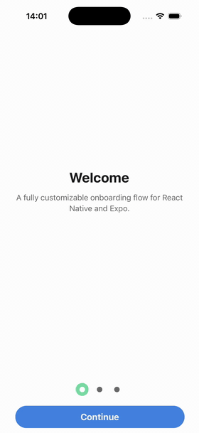

<div align="center">



# animated-onboarding-steps

A drop-in onboarding flow for React Native and Expo whose step indicator animates as a single connected track — the pill grows to link every completed step instead of lighting up dots one by one — with the back and continue buttons, labels, colours and spring all customizable from props.

</div>

## Features

- **60fps animations** — the track sweep and the dot crossfade run on the UI thread through [react-native-reanimated](https://docs.swmansion.com/react-native-reanimated/) worklets, so they never stutter when JS is busy.
- **One source of truth** — the track width and every dot colour derive from a single shared value, so they cannot drift apart, including when the user goes backwards.
- **Cross-platform** — built on core primitives (`View`, `Text`, `Pressable`) plus Reanimated: iOS, Android and Web.
- **Customizable layout** — override the indicator's sizes, spacing, colours and spring through one `stepsTheme` object; the rest falls back to sensible defaults.
- **Bring your own buttons** — recolour the stock buttons, or replace either one with a render prop and keep the built-in show/hide animation.
- **Per-step labels and content** — each step carries its own content and can override the back, continue and finish labels.
- **TypeScript-first** — every prop is typed and documented inline.
- **Zero Babel config on Expo SDK 54+** — `babel-preset-expo` wires the Reanimated plugin automatically.

## Installation

```sh
npm install @ded3zito/animated-onboarding-steps
```

```sh
yarn add @ded3zito/animated-onboarding-steps
```

```sh
pnpm add @ded3zito/animated-onboarding-steps
```

This package expects `react-native-reanimated` v4 (and its `react-native-worklets` companion) to be installed in your app. On Expo:

```sh
npx expo install react-native-reanimated react-native-worklets
```

## Usage

```tsx
import { StyleSheet, Text, View } from 'react-native';
import { Onboarding, type OnboardingStep } from '@ded3zito/animated-onboarding-steps';

const Slide = ({ title }: { title: string }) => (
  <View style={styles.slide}>
    <Text style={styles.title}>{title}</Text>
  </View>
);

const steps: OnboardingStep[] = [
  { id: 'welcome', content: <Slide title="Welcome" /> },
  { id: 'customize', content: <Slide title="Customize" /> },
  {
    id: 'ship',
    content: <Slide title="Ship it" />,
    finishButtonLabel: 'Get started',
  },
];

export default function Welcome({ onDone }: { onDone: () => void }) {
  return (
    <Onboarding
      steps={steps}
      onComplete={onDone}
      onStepChange={(index, step) => console.log('step', index, step.id)}
    />
  );
}

const styles = StyleSheet.create({
  slide: { flex: 1, justifyContent: 'center', alignItems: 'center' },
  title: { fontSize: 28, fontWeight: '700' },
});
```

`Onboarding` fills its parent, so give it a container with height — a screen,
a `SafeAreaView`, or any `flex: 1` view.

### Theming the indicator

Pass only what you want to change — everything else comes from `defaultStepsTheme`.

```tsx
<Onboarding
  steps={steps}
  stepsTheme={{
    trackColor: '#FF6B6B',
    stepSize: 34,
    dotSize: 8,
    stepGap: 16,
    inactiveDotColor: '#C7C7CC',
  }}
  continueButtonColor="#1C1C1E"
/>
```

> Hoisting the theme object out of render (or wrapping it in `useMemo`) keeps it from being rebuilt on every render. It is safe either way — the spring is held in a ref so a new object cannot restart an animation in flight.

### Custom buttons

Either button can be replaced entirely. The renderer receives everything it needs to draw itself and act, and the back button still fades in and out with the flow.

```tsx
<Onboarding
  steps={steps}
  backButton={({ label, onPress }) => (
    <Pressable onPress={onPress} style={styles.customBack}>
      <Text style={styles.customBackLabel}>← {label}</Text>
    </Pressable>
  )}
/>
```

## API

Every type below is exported from the package root and documented inline in
[`src/types.ts`](src/types.ts).

### `<Onboarding />`

| Prop | Type | Default | Description |
| --- | --- | --- | --- |
| `steps` | `OnboardingStep[]` | — | The flow. Nothing renders when empty. |
| `initialStep` | `number` | `0` | Step to open on. Clamped into range. |
| `onComplete` | `() => void` | — | Fires when the primary button is pressed on the last step. The flow stays put — navigating away is your call. |
| `onStepChange` | `(index, step) => void` | — | Fires on every step change, forwards and backwards. |
| `onBack` | `(index, step) => void` | — | Fires when the back button rewinds a step. `onStepChange` fires too. |
| `stepsTheme` | `StepsThemeInput` | `defaultStepsTheme` | Partial override of the indicator's look. |
| `backButtonColor` | `string` | `#F1F1F1` | Background of the stock back button. |
| `backButtonLabelColor` | `string` | `#1C1C1E` | Label colour of the stock back button. |
| `backButton` | `OnboardingButtonRenderer` | — | Replaces the stock back button. |
| `continueButtonColor` | `string` | `#4382DF` | Background of the stock continue/finish button. |
| `continueButtonLabelColor` | `string` | `#F7F4ED` | Label colour of the stock continue/finish button. |
| `continueButton` | `OnboardingButtonRenderer` | — | Replaces the stock continue/finish button. |
| `style` | `StyleProp<ViewStyle>` | — | Style for the outermost container. |
| `contentStyle` | `StyleProp<ViewStyle>` | — | Style for the region hosting the active step's `content`. |

### `OnboardingStep`

| Field | Type | Description |
| --- | --- | --- |
| `id` | `string \| number` | Stable identity, used as the React key. Required. |
| `content` | `ReactNode` | Fills the area above the indicator while this step is active. |
| `backButtonLabel` | `string` | Overrides the `"Back"` label on this step. |
| `continueButtonLabel` | `string` | Overrides the `"Continue"` label on this step. |
| `finishButtonLabel` | `string` | Overrides the `"Finish"` label. Last step only. |

### `StepsTheme`

Supplied partially as `stepsTheme`; gaps are filled from `defaultStepsTheme`.

| Field | Type | Default | Description |
| --- | --- | --- | --- |
| `stepSize` | `number` | `26` | Diameter of a step's slot, and the track's height. |
| `dotSize` | `number` | `11` | Diameter of the dot inside each slot. |
| `stepGap` | `number` | `9` | Horizontal space between two slots. |
| `trackColor` | `string` | `#7ADAA5` | The pill connecting completed steps. |
| `activeDotColor` | `string` | `#fff` | Dot colour once the track has swept over it. |
| `inactiveDotColor` | `string` | `#696969` | Dot colour before the track reaches it. |
| `spring` | `WithSpringConfig` | `{ damping: 22, stiffness: 180, mass: 1 }` | Drives the sweep and the colour crossfade. |

### `OnboardingButtonProps`

What a custom button renderer receives.

| Field | Type | Description |
| --- | --- | --- |
| `label` | `string` | Resolved from the step, falling back to the built-in default. |
| `onPress` | `() => void` | Advances or rewinds the flow. |
| `currentStep` | `number` | Zero-based index of the active step. |
| `totalSteps` | `number` | Number of steps in the flow. |

### Also exported

`Steps`, `Step` and `Button` are exported if you want the indicator on its own,
along with `defaultStepsTheme`, `resolveStepsTheme` and the `trackWidth` worklet.

## Running the example

```sh
pnpm install
pnpm ios     # or: pnpm android
```

The example lives in [`example/App.tsx`](example/App.tsx) and consumes the
library straight from `src/`.

## License

MIT © Andrew Azevedo
